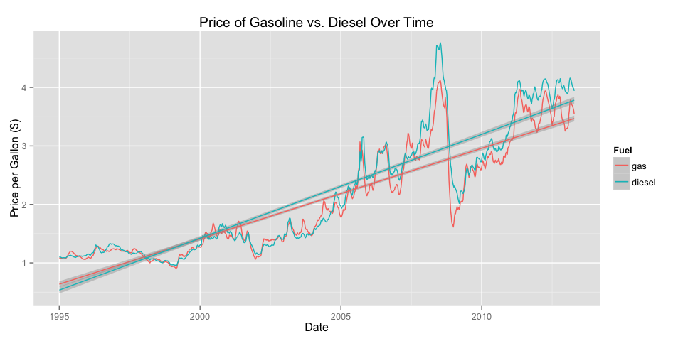
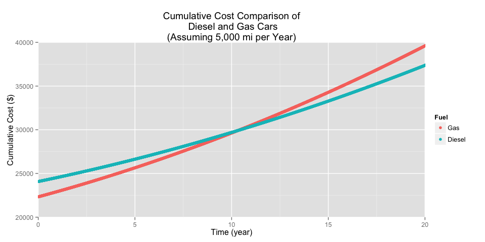
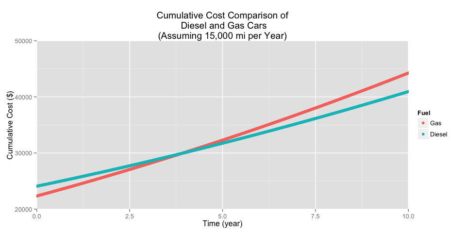

# Gasoline or Diesel
Miguel  
April 7, 2015  


```
## Warning: package 'ggplot2' was built under R version 3.1.3
```

```
## Warning: package 'zoo' was built under R version 3.1.3
```


*Ever since some guy totaled my parked car a couple of weeks ago, I've been in the market for a replacement. I'm considering getting a car that uses diesel rather than gas, but is that economical? And if it is, when do I start seeing a return on my investment?*

We'll get our gas and diesel data from Quandl.

 

We see that the two are very closely related, but for the past couple of years diesel has been a little bit more expensive. But remember that diesel cars, which are more expenisive, also get better milage. If gasoline and diesel prices continue to increase as they have been, let's see if better milage translates to savings.

As an example, let's look at the 2015 VW Jetta SE (with Connectivity), which comes in either a gasoline ($22,325; 25/34 mpg) or a diesel ($24,075; 31/46 mpg) model. These two models have basically the same features (seats, navigation, etc.), save for the fuel they use.


How long do I need to drive a diesel to make up for the initial price difference? We'll use a simplistic linear model to predict gas and diesel prices over the next couple of years. Then we'll find the cumulative sum of the cost of fuel over time. 

 

So remember, the y axis shows the cumulative cost. So the diesel price starts off much more expensive, since the diesel engine is about $2000 more than the gasoline engine. Even despite the more expensive diesel prices, the better mileage ends up making the diesel car *cheaper* in the long run! How long are we talking? According to this model, 10 years, which isn't quite as good as we hoped. 

We should remember that our linear model was based of off 15 years of gas prices, so it may not be the most accurate model ever. Also, remember that I used an estimate of 5,000 miles per year, which may not be representative of most people, or even representative of my own driving habits once I finish college and get a job. Adjusting this factor to match the average driving distance of a 20-30 year old male (15,000 mi), we see that the diesel model ends up being cheaper after about 3-5 years.

 

I was curious about the accuracy of my model, and found [this study](http://www.dieselforum.org/files/dmfile/20130311_cd_umtritcofinalreport_dd2017.pdf) by The University of Michigan Transportation Research Institute. They also found that the return on investment happened around 3 to 5 years for most cars, though they took into account a couple of other factors like depreciation value and repairs. It turns out that diesel cars retain their value better since they are more expensive to begin with, and the engines tend to last much longer. The enviromental aspects are also not considered.

So I guess if I plan on driving like the typical 20 to 30 year old male, I'd better get a diesel!
