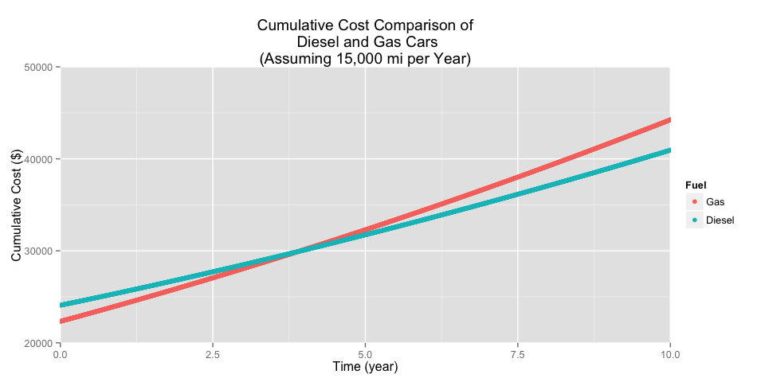

# Gasoline or Diesel
Miguel Conner, Reed College  
April 7, 2015  


*Ever since my parked car was totaled a couple of weeks ago, I've been in the market for a replacement. I'm considering getting a car that uses diesel rather than gas, but I wanted to make sure that it was economical.*

### Load Data and Set Parameters

We'll get our gas and diesel data from Quandl. The data sets were generated by the Bureau of Transportation Statistics, and contain weekly gasoline and diesel prices in the US from January 1, 1995 to April 15, 2013.


```r
diesel <- Quandl("BTS_MM/MOTOR_FUEL_DIESEL_PRICE")
gas <- Quandl("BTS_MM/MOTOR_FUEL_GASOLINE_PRICE")
```

Next we'll define some of our inputs. These can be adjusted depending on the car models we're comparing or the type of driving I expect to do.


```r
# Estimated city/highway MPG for gas vs diesel car
g_city <- 25
g_highway <- 34
d_city <- 31
d_highway <- 46

# Estimate of typical city vs highway driving ratio by fueleconomy.gov
city.ratio <- 0.55
highway.ratio <- 0.45

# Calculate a combined weighted average MPG value
g_mpg <- g_city*city.ratio + g_highway*highway.ratio
d_mpg <- d_city*city.ratio + d_highway*highway.ratio

# Car prices of the VW Jetta.
dieselcar <- 24075 
gascar <- 22325

# Number of miles I drive in a year and in a day (based on previous car).
mi_year <- (40000-15000)/5
mi_day <- mi_year/365.25

# Average number of miles per day for a 20-30 year old male.
avg_day <- 15000/365.25
```

### Gas and Diesel Prices: Linear Model

Let's take a look at our data, and see if we can fit one linear model to gas prices and another to diesel prices.

 

We see that the two are very closely related, but for the past couple of years diesel has been a little bit more expensive. Diesel cars are usually more expensive, but they also get better mileage. If gasoline and diesel prices continue to increase as they have been, does the better mileage end up saving the diesel?

### The Options

As an example, let's look at the 2015 VW Jetta SE (with Connectivity), which comes in either a gasoline ($22,325; 25 city/34 highway mpg) or a diesel ($24,075; 31 city/46 highway mpg) model. These two models have basically the same features (seats, navigation, etc.), save for the fuel they use.  To estimate the combined fuel economy of each car we'll use the standard implemented by fuel economy.gov, which is 55% city driving and 45% highway driving. This gives us a 29 mpg rating for the gas car and a 38 mpg rating for the diesel car. 

### The Calculation for Current Driving Habits

How long do I need to drive a diesel to make up for the initial price difference? We'll use a simplistic linear model to predict gas and diesel prices over the next couple of years, assuming current trends hold. Then we'll find the cumulative sum of the cost of fuel over time plus the initial cost of the car. 

 

The y axis shows the cumulative cost. The diesel price starts off much more expensive, since the diesel engine is about 
$2,000 more than the gasoline engine. Even despite the more expensive diesel prices, the better mileage ends up making the diesel car *cheaper* in the long run! It looks like this model suggests a return on investment after 10 years, which is OK I guess, but it's not great.

### The Calculation for Future Driving Habits

Note that for the above calculation I used an estimate of 5,000 miles per year, which may not be representative of most people, or even representative of my own driving habits once I finish college and get a job. Adjusting this factor to match the average driving distance of a 20-30 year old male (15,000 mi per year), we see that the diesel model ends up being cheaper after about 3.5 to 4 years.

 

### Conclusions and Limitations

I was curious about the accuracy of my model so I did some digging and found [this study](http://www.dieselforum.org/files/dmfile/20130311_cd_umtritcofinalreport_dd2017.pdf) by The University of Michigan Transportation Research Institute. They showed that the return on investment happened around 3 to 5 years for most cars, although they took into account a couple of other factors like depreciation value and repairs. Some positives I haven't considered: diesel cars retain their value better since they are more expensive to begin with, and the engines tend to last much longer. As for negatives, maintenance and repairs tend to be a little costlier for diesels. The environmental aspects are not considered, though manufacturers assure us that "clean diesel" (which contains much less sulfur than the diesel of the 1980's) has a the same environmental impact as gasoline. Finally, although our data set spans 10 years, it doesn't include data from the past two years. 

Overall, we see compelling evidence that getting a diesel car could save me around $2,000 over the next 8 years. 

